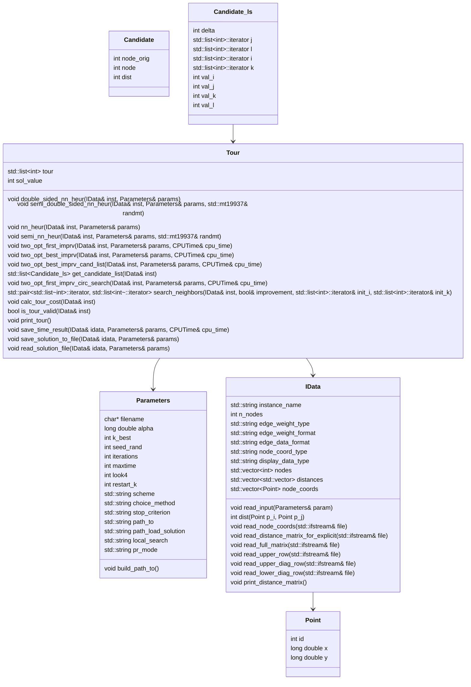

<h1 align="center">🧑‍💼 TSP Experiments 🧑‍💼</h1>

<div align="center">
	<a href="link_for_webite">
	
    </a>
</div>

## Developed by 💻:
- [Fernando Schettini](https://linktr.ee/fernandoschett).
- [Vitor Alves Barbosa Schettini](https://github.com/MrAlves17).

## Special thanks to 🥰:
- [Celso C. Ribeiro](http://profs.ic.uff.br/~celso/), our advisees in this work.

## About 🤔:

This repository contains the implementation of various algorithms designed to tackle the Traveling Salesman Problem (TSP). The project is part of the evaluation for the Topics in Computational Systems III course at the Federal University of Bahia (UFBA), supervised by Professor Celso da Cruz Carneiro Ribeiro, conducted in the first semester of 2023. The repository includes the implementation of adaptive greedy heuristics, multi-start procedures, local search  and path relinking algorithms.

The source code and datasets used for testing are provided to facilitate further research and replication of results (avaliable at [here]()). You can also read `./results_tsp_project.pdf` to get experiment analysis and graphs, or check this [Overleaf link](https://www.overleaf.com/read/yzgxqkwwzkwt#623679) for the online version. For a quicker approach, check out our YouTube presentation available at this [link]().

## Resourses 🧑‍🔬:

- TSP instances and solutions **reader**; 
- **Constructive Heuristics:** Nearest Neighbor and Double-Sided Nearest Neighbor (Greedy and Semi-Greedy, alpha and k_best);
- **Local Search** (Two-opt Best Improvement, First Improvement, Candidade lists and Circular Search);
- **Path Relinking** with restart;
- **GRASP Heuristic** (GRASP, GRASP + Path Relinking and GRASP + Path Relinking + Restart);
- **Executions Test Scripts**;
- **Experiments Analysis and graphs** at `./results_tsp_project.pdf`; 
- **Logs generators**.

## Repo Overview 📝:

- `./benchmarck/` contains all instances (data) and serves as the log and solution folder.
- `./build/` contains the build files;
- `./results/` contains the final results at each `./src/tsp.cpp` execution;
- `./src/` contains all implemented code: `./src/lib/` for functions, `./src/include/` for headers, and `./src/tsp.cpp` as the main script;
- `./scripts/` contains the scripts used to run all experiments and gather data;
- `./tttplots/` contains the scripts used for creating time-to-target graphs;
- `./results_tsp_project.pdf` is the final document with all experiment results and TSP analysis.

## How to run it 🏃:

First, clone this repository. After that, yout can use some of scripts avaliable at ```./scripts/``` or simply type:
    
    make all
    ./TSP [options]

## UML‍ 💬:

Heres the UML that represents how the application works with their classes.



<h4 align="center">Figure 2 - <app_name> UML.</h4>

## Logic Model 🧮:

Here's the logic model that represents how the code works with their classes.

<div align="center">
	<a href="">
	
    </a>
</div>
<h4 align="center">Figure 3 - Logic Model.</h4>

### Tools Used 🛠️: 

- [GNUPLOT](http://www.gnuplot.info/);
- [VS CODE](https://code.visualstudio.com/);
- [Overleaf](https://pt.overleaf.com/).
	
## How to contribute 🫂:

Feel free to create a new branch, fork the project, create a new Issue or make a pull request contact one of us to develop at tsp_project.

## Licence 📜:

[Apache V2](https://choosealicense.com/licenses/apache-2.0/)

## References 📙:
	
[1] [Karp 1972] Karp, R. M. (1972). Reducibility among Combinatorial Problems, page
85–103. Springer US.
	
[2] [Reinelt 1991] Reinelt, G. (1991). TSPLIB–a traveling salesman problem library. ORSA
Journal on Computing, 3(4):376–384.

[3] [Resende and Ribeiro 2016] Resende, M. G. and Ribeiro, C. C. (2016). Optimization by
GRASP: Greedy Randomized Adaptive Search Procedures. Springer New York.
